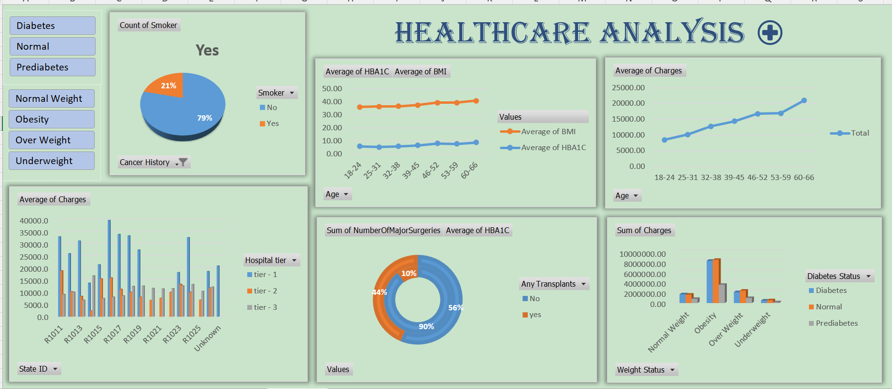

# 🏥 Healthcare Data Analysis (Excel Project)

## 📊 Project Overview
This project analyzes healthcare data using Microsoft Excel to identify trends in patient demographics, health indicators, hospital tiers, and medical charges.

The objective was to transform raw healthcare data into actionable business insights through dashboards and analytical techniques.

---

## 🛠 Tools & Techniques Used
- Microsoft Excel
- Data Cleaning
- Pivot Tables
- Charts & Visualizations
- Dashboard Design
- Descriptive Analysis

---

## 📈 Key Analysis Areas
- Age-wise Health Trends (BMI & HbA1c)
- Smoking Distribution
- Hospital Tier vs Charges
- Weight Status Impact on Revenue
- Diabetes Category Comparison

---

## 📊 Dashboard Preview

---

## 🔍 Key Insights

- Healthcare charges increase consistently with age.
- Obesity category generates the highest medical revenue.
- Tier 1 hospitals charge significantly higher than Tier 2 and Tier 3.
- BMI and HbA1c levels rise with age, increasing chronic disease risk.
- Smokers represent a smaller group but are considered a high-risk segment.

---

## 📌 Business Conclusion
Age, obesity, and hospital tier are major drivers of healthcare expenditure. Preventive healthcare strategies and efficient resource allocation can significantly improve operational efficiency and cost management.

---

## 📂 Repository Structure

dataset/
healthcare_dataset.xlsx

dashboard/
dashboard.png

pivot_table/
pivot_table.png

README.md

## 🚀 Skills Demonstrated

* Data Cleaning
* Data Analysis using Excel
* Pivot Table Analysis
* Data Visualization

## 📌 Conclusion

This project demonstrates how Excel can be used effectively for healthcare data analysis and dashboard creation to generate meaningful insights.

